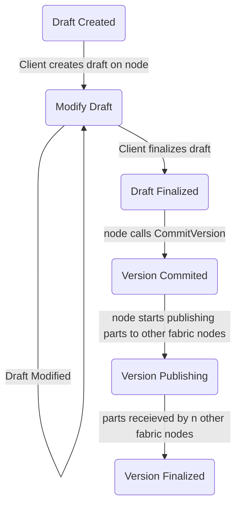

# Content Objects
Content objects are the main way tenants store and retrieve data, globally referenced by $(\tenantid, \conqid)$.
They are created by storing data in a node, who calls \textbf{CommitVersion} with a digest of the data.
Once the verison is commited, other nodes in the space can retrieve the content object.
Once a sufficient number of nodes retrieve copies of the content object[^1], the original authoring node submits a **ConfirmVersion** which marks the commit as finalized.

In order to prevent nodes from creating arbitrary versions without permission of tenants, a version commit message ($\vcm$) and signature $\sig_\vcm$ by a tenant must be provided in the **CommitVersion** call.
A $\vcm$ contains the following, scale encoded:

```
  VersionCreateMessage {
    originator: ProviderId,
    tenant_id: TenantId,
    content_object_id: ContentObjectId,
    tlp_size: compact uint,
    digest: VersionId,
    ts: u64,
  }
```

### Content Objects and Libraries
Libraries are the permission structure that describes who can create content objects and content object versions.
Upon creation, an optional $\libid$ field may be provided. 
If no $\libid$ is provided, then only keys with at least admin level in $\tenantid$ can create/modify versions.
If that field is provided, then any key which has edit rights can create/modify versions.
This makes libraries an optional component: if you want to use them, set them up with the proper keys and use them.
Otherwise, tenant admin keys are used for creating/modifying content.

It's helpful to picture libraries as a filesystem with one level of folders:

```
Content Objects:
 - Content Object 1 <- Operated by tenant admins
 - Content Object 2 <- Operated by tenant admins
 - Library 1:
    - Content Object 3 <- Operated by Library 1 admins
    - Content Object 4 <- Operated by Library 1 admins
 - Library 2:
    - Content Object 5 <- Operated by Library 2 admins
    - Content Object 6 <- Operated by Library 2 admins
```

Content objects are universally referred to by $(\tenantid, \conqid)$, hence they can be moved between libraries.
A sample use case would be to have one library for staging and one for production.

```
Content Objects.
 - Staging Library.
    - Staging Movie A <- Can move to production when finished
    - Staging Movie B
 - Production Library <- Things served to end users.
    - Public Production Movie C
}
```

Loosely protected staging keys can be assigned to modify staging content only viewed internally in the tenancy.
When the content is ready for production, a tenant admin (or similar role) can move the content from the staging library in to the production library, where keys are much more closely guarded.


### Content Object Lifecycle
TODO(WILL): I'm sure there's more to this lifecycle



### Content Types
TODO: Discuss

### Content Object Blockchain Calls

* **CreateContentObject($\korigin, \tenantid, \conqid, \opt \libid$)**
  - If $\opt \libid$ is none, checks that $\korigin$ has at least admin permissions in $\tenantid$
  - Otherwise, if $\opt \libid$ is some $\libid$, checks that $\korigin$ has edit rights
  - Registers $\conqid$ with its associated $\opt \libid$ to $\tenantid$, 

* **CommitVersion($\korigin, \tenantid, \conqid, \versid, \ksigner, \vcm, \sig$)**
  - Checks that $\korigin$ has permission level $\perm{node}$ within the $\provid$ specified in $\commitmsg$.
  - Retrieve the $\opt \libid$ for $(\tenantid, \conqid)$.
    * If it's none checks that $\ksigner$ has at least admin level in $\tenantid$ 
    *  Otherwise, checks that $\keyid{signer}$ has edit rights in $\libid$   
  - Checks that $\sig$ is a valid signature of $\commitmsg$ by $\ksigner$
  - Stores the version $\versid$ with the relevant metadata in $\vcm$ and a `pending=true` flag

* **FinalizeVersion($\korigin, \provid, \tenantid, \conqid, \versid$)**
  - Checks that $\korigin$ has at least node level within $\provid$.
  - Checks that $\provid$ matches the $\provid$ stored in the metadata of the version stored in $(\tenantid, \conqid, \versid)$ [^2]
  - Removes the pending flag from the version at $(\tenantid, \conqid, \versid)$

[^1] *TODO:* Should also talk about partitioning and how we assert data is replicated

[^2] This should probably check node id instead. That would require closer coupling of the node and a key it holds, which currently doesn't exist.
