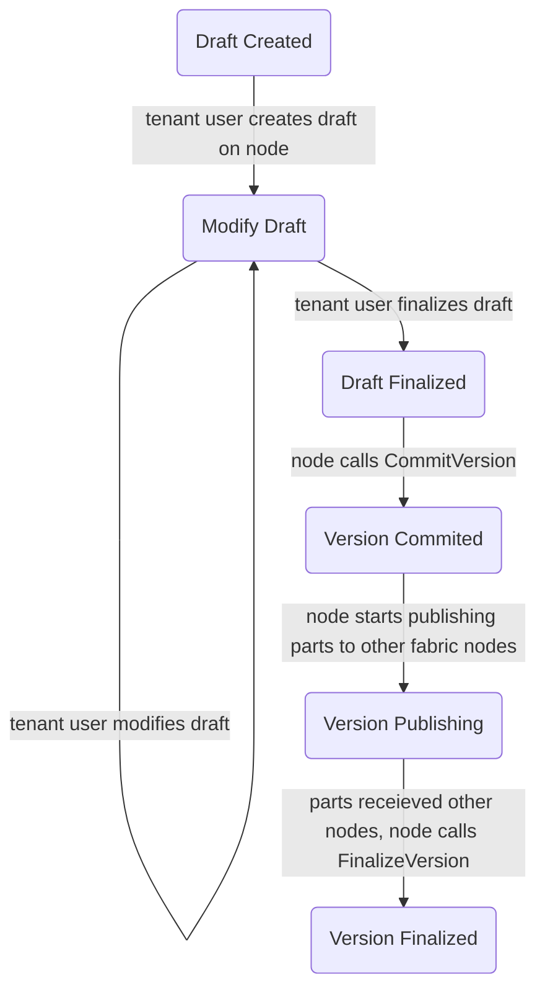

# Content Objects
Content objects are the main way tenants store and retrieve data, globally referenced by `(TenantId, ConqId)`.
They are created by storing data in a node, who calls **CommitVersion** with a digest of the data.
Once the verison is commited, other nodes in the space can retrieve the content object.
Once a sufficient number of nodes retrieve copies of the content object[^1], the original authoring node submits a **ConfirmVersion** which marks the commit as finalized.
Each content object also has a 'head' version which refers to the version that should be retrieved when a content object is referred to by its ID.

In order to prevent nodes from creating arbitrary versions without permission of tenants, a tenant-signed version commit message (`VersionCommitMessage`) must be provided in the **CommitVersion** call.

```
  VersionCommitMessage {
    originator: ProviderId,
    tenant_id: TenantId,
    content_object_id: ContentObjectId,
    tlp_size: #[compact] u64,
    version_id: VersionId,
    ts: u64,
    set_head_on_finalize: bool,
  }
```

### Content Object Lifecycle


### Content Types
TODO: Discuss

### Content Object Blockchain Storage

```
(TenantId, ContentObjectId) -> {
  head_version: Option<VersionId>,
  version_count: u32,
}
(TenantId, ContentObjectId, VersionId) -> {
  originator: ProviderId,
  tlp_size: #[compact] u64,
  ts_committed: u64,
  ts_finalized: Option<u64>,
  set_head_on_finalize: bool
}
```

### Content Object Blockchain Calls

* **`CreateContentObject(origin: Origin, ten: TenantId, cobj: ContentObjectId)`**
  - Checks that `origin` has at least `CONTENT` permissions in `ten`
  - Stores the content object at `(ten, cobj)`
    ```
      {
        head_version: None,
        version_count: 0,
      }
    ```

* **`CommitVersion(origin: Origin, tenant_signer: AccountId, vcm: VersionCommitMessage, vcm_sig: Signature)`**
  - Checks that `origin` has `NODE` level permission within `vcm.provider_id`
  - Checks that `tenant_signer` has `CONTENT` level permission within `vcm.tenant_id`
  - Checks that `vcm_sig` is a valid signature of the scale encoded `vcm` by `tenant_signer`
  - Increment `version_count` at `(vcm.tenant_id, vcm.content_object_id)`
  - Stores the version at  `(vcm.tenant_id, vcm.content_object_id, vcm.version_id)` 
    ```
      {
        originator: vcm.originator,
        tlp_size: vcm.tlp_size,
        ts_committed: vcm.ts,
        ts_finalized: None,
        set_head_on_finalize: vcm.set_head_on_finalize
      }
    ```

* **`FinalizeVersion(origin: Origin, provider: ProviderId, ten: TenantId, cobj: ContentObjectId, ver: CObjVersionId, ts: u64)`**
  - Checks that `origin` has at least node level within `provider`.
  - Retrieve the version metadata, `ver_meta`, stored at `(ten, cobj, ver)`
  - Checks that `provider` matches the `ver_meta.originator`
  - Checks that `ts` is a recent timestamp
  - Sets `ver_meta.ts_finalized = Some(ts)`
  - If `ver_meta.set_head_on_finalize`, sets the `head_version` of the content object at `(ten, cobj)` to `ver`

[^1] *TODO:* Should also talk about partitioning and how we assert data is replicated
