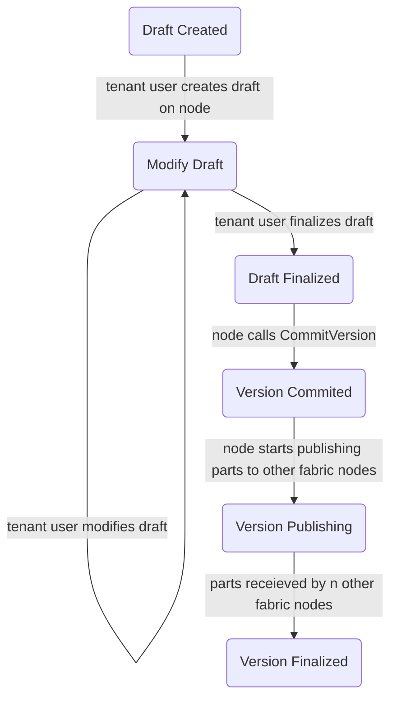

# Content Objects
Content objects are the main way tenants store and retrieve data, globally referenced by `(TenantId, ConqId)`.
They are created by storing data in a node, who calls \textbf{CommitVersion} with a digest of the data.
Once the verison is commited, other nodes in the space can retrieve the content object.
Once a sufficient number of nodes retrieve copies of the content object[^1], the original authoring node submits a **ConfirmVersion** which marks the commit as finalized.

In order to prevent nodes from creating arbitrary versions without permission of tenants, a tenant-signed version commit message (`VersionCommitMessage`) must be provided in the **CommitVersion** call.

```
  VersionCommitMessage {
    originator: ProviderId,
    tenant_id: TenantId,
    content_object_id: ContentObjectId,
    tlp_size: #[compact] u64,
    digest: VersionId,
    ts: u64,
  }
```

### Content Objects and Libraries
Libraries are the permission structure that describes who can create content objects and content object versions.
Upon creation, an `Option<LibraryId>` field may be provided. 
If no `LibraryId` is provided, then only keys with at least admin level in `TenantId` can create/modify versions.
If that field is provided, then any key which has edit rights can create/modify versions.
This makes libraries an optional component: if you want to use them, set them up with the proper keys and use them.
Otherwise, tenant admin keys are used for creating/modifying content.

It's helpful to picture libraries as a filesystem with one level of folders:

```
Content Objects:
 - Content Object 1 <- Operated by tenant admins
 - Content Object 2 <- Operated by tenant admins
 - Library 1:
    - Content Object 3 <- Operated by Library 1 admins
    - Content Object 4 <- Operated by Library 1 admins
 - Library 2:
    - Content Object 5 <- Operated by Library 2 admins
    - Content Object 6 <- Operated by Library 2 admins
```

Content objects are universally referred to by `(TenantId, ContentObjectId)`, hence they can be moved between libraries.
A sample use case would be to have one library for staging and one for production.

```
Content Objects.
 - Staging Library.
    - Staging Movie A <- Can move to production when finished
    - Staging Movie B
 - Production Library <- Things served to end users.
    - Public Production Movie C
}
```

Loosely protected staging keys can be assigned to modify staging content only viewed internally in the tenancy.
When the content is ready for production, a tenant admin (or similar role) can move the content from the staging library in to the production library, where keys are much more closely guarded.


### Content Object Lifecycle
TODO(WILL): I'm sure there's more to this lifecycle



### Content Types
TODO: Discuss

### Content Object Blockchain Calls

* **`CreateContentObject(origin: Origin, ten: TenantId, cobj: ContentObjectId, lib: Option<LibraryId>)`**
  - If `lib` is none, checks that `origin` has at least admin permissions in `ten`
  - Otherwise, if `lib` is some `LibraryId`, checks that `origin` has edit rights
  - Registers `ContentObjectId` with the associated `Option<LibraryId>` to `TenantId`, 

* **CommitVersion(`origin: Origin, ten: TenantId, cobj: ContentObjectId, ver: CObjVersionId, tenant_signer: AccountId, vcm: VersionCommitMessage, vcm_sig: Signature`)**
  - Checks that `Ooigin` has `NODE` level permission within `vcm.provider_id`
  - Retrieve the `Option<LibraryId>` for `(TenantId, ContentObjectId)`
    * If it's none checks that `AccountId` has at least admin level in `TenantId` 
    *  Otherwise, checks that `tenant_signer` has edit rights within `LibraryId`   
  - Checks that `vcm_sig` is a valid signature of the scale encoded `vcm` by `tenant_signer`
  - Stores the version at  `(ten, cobj, ver)` with the relevant metadata in `vcm` and a `pending=true` flag

* **FinalizeVersion(`origin: Origin, provider: ProviderId, ten: TenantId, cobj: ContentObjectId, ver: CObjVersionId`)**
  - Checks that `origin` has at least node level within `provider`.
  - Checks that `provider` matches the `provider` stored in the metadata of the version stored in `(TenantId, ContentObjectId, CObjVersionId)` [^2]
  - Removes the pending flag from the version at `(TenantId, ContentObjectId, CObjVersionId)`

[^1] *TODO:* Should also talk about partitioning and how we assert data is replicated

[^2] This should probably check node id instead. That would require closer coupling of the node and a key it holds, which currently doesn't exist.
