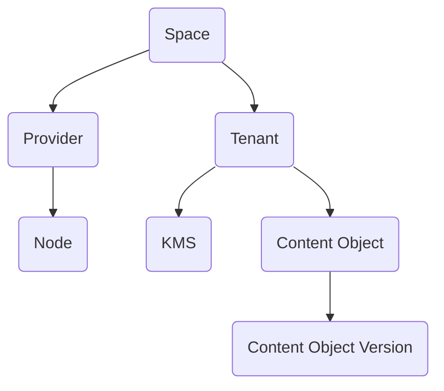

# Data Hierarchy and Key Prefixing

Many of the entities in the system are scoped, meaning they only exist under another identity.
Individually, they have the following IDs:

| Entity                 | Identifier      | Substrate Type          |
| :---:                  | ---             | ---                     |
| Provider               | `ProviderId`    | 10-byte array           |
| Tenant                 | `TenantId`      | 10-byte array           |
| Node                   | `NodeId`        | 10-byte array           |
| Space                  | `SpaceId`       | 10-byte array           |
| Content Object         | `CobjId`        | 10-byte array           |
| Content Object Version | `CobjVersionId` | 32-byte array           |
| KMS                    | `KMSId`         | 10-byte array           |


But they are hierarchical. 



Providers and tenants exist within spaces, KMSs exist within a tenancy, etc.

## Substrate & Hierarchical keys

In substrate, we have two different ways of expressing these sorts of has-many relationships.

### Flat IDs with metadata
We can either store the parent in some metadata key-value map associated with the child, like 
```
TenantId --> TenantMetadata { space_id: SpaceId, ... }
```

In this case:
* `TenantId`s are global: there's no way for the same `TenantId` to exist within multiple spaces. 
* In order to list all the tenants within a space, an indexer is required.
* All you need to refer to a specific tenant is the `TenantId`, since the `SpaceId` is implied.
* Deleting a space becomes complicated:
  - The total number of tenants must be stored on the space: `SpaceId --> SpaceMetadata { tenant_count: u32 }`
  - Each tenant must be manually deleted, and the `tenant_count` must be decremented on each delete
  - Once the `tenant_count` reaches 0, all other space-related storage can be deleted

### Nested IDs
Alternatively, we can choose to prefix the `TenantId` by the `SpaceId` anywhere that tenant data is stored, so we would get
```
(SpaceId, TenantId) --> TenantMetadata { ... }
```

In this case:
* To refer to a tenant, both the `SpaceId` and `TenantId` must be given, since the `TenantId` is not unique across spaces
* Listing tenants is easy,
* Deleting the parent entity becomes much easier: 
  - In order to delete a space, all the keys under `(SpaceId, TenantId)` must be deleted as well
  - On chain, we can do a key prefix delete which clears out all keys of the form `(SpaceId, ...)` (in RocksDb this sort of write is fast)
  

## Current architecture
It is annoying to refer to certain entities by both their id and their parents' ids, so in cases where deletion may not be so common (such as that for a space), flat ids are used.

Here is a complete list of how the IDs stored:

| Entity                 | Complete Id                                         |
| :---:                  | ---                                                 |
| Provider               | `ProviderId`                                        |
| Tenant                 | `TenantId`                                          |
| Node                   | `(ProviderId, NodeId)`                              |
| Space                  | `SpaceId`                                           |
| Content Object         | `(TenantId, ContentObjectId)`                       |
| Content Object Version | `(TenantId, ContentObjectId, ContentObjectVersion)` |
| KMS                    | `(TenantId, KMSId)`                                 |

All provider and tenant children use nested IDs. 
Tenants and Providers use flat ids, since deleting a whole space should be considered very rare.
Tenants and providers may be often be deleted, however, for governance reasons. 
Some single blockchain call, then, needs to be able to delete an entire provider or entire tenancy.
To do this, the keys prefix deletes are needed to clean up their data.

### Potential alternative
An alternative is this: instead of doing some sort of hierarchical delete, governance could store a flag called `governance_delete`, stored in the metadata of a provider or tenant. 
Specific `governance_delete_*` methods could then exist on all children, who look up their parents, metadata, check that `governance_delete == true`, and delete the requested child.
This would allow for using a flat id with metadata, while still having governance be able to delete a child.


